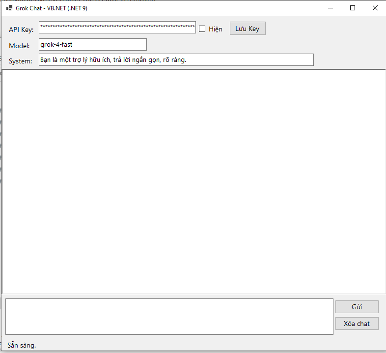

# Grok Chat App (VB.NET / .NET 9)

<p align="center">
  
</p>

Ứng dụng chat desktop (WinForms) viết bằng VB.NET, tích hợp xAI Grok API (endpoint tương thích OpenAI Chat Completions).

## Yêu cầu
- Windows
- [.NET 9 SDK](https://dotnet.microsoft.com/download/dotnet/9.0)
- API Key của xAI: lấy tại https://console.x.ai
  (Không cần X Premium — đây là sản phẩm dev riêng, trả theo token, có credit dùng thử khi đăng ký)

## Cấu trúc project
```
GrokChatApp/
├── GrokChatApp.vbproj    # File project (.NET 9, WinForms)
├── Program.vb            # Entry point
├── MainForm.vb           # Giao diện + logic gọi Grok API
├── build.bat               # Batch build (dotnet restore + build)
├── publish.bat              # Batch publish thành 1 file .exe độc lập
└── README.md
```

## Cách chạy

### 1. Build bằng batch script (Windows)
```
build.bat
```
Sau khi build xong, chạy file:
```
bin\Release\net9.0-windows\GrokChatApp.exe
```

### 2. Hoặc dùng lệnh dotnet trực tiếp
```
dotnet build -c Release
dotnet run
```

### 3. Đóng gói thành 1 file .exe độc lập
```
publish.bat
```
File kết quả: `bin\Release\net9.0-windows\win-x64\publish\GrokChatApp.exe`

## Cách dùng app
1. Dán **API Key** xAI vào ô "API Key" (tạo tại console.x.ai).
2. (Tuỳ chọn) Bấm **Lưu Key** để lưu lại (lưu dạng text tại `%AppData%\GrokChatApp\config.txt`).
3. Chọn **Model** (mặc định `grok-4-fast`; có thể đổi sang `grok-4`, `grok-3`, `grok-4.1-fast`, v.v. — xem danh sách model mới nhất tại https://docs.x.ai/docs/models).
4. (Tuỳ chọn) Sửa ô **System** để đặt vai trò/phong cách trả lời.
5. Gõ tin nhắn, nhấn **Enter** hoặc bấm **Gửi**.
6. Bấm **Xóa chat** để bắt đầu hội thoại mới.

## Lưu ý bảo mật
- API Key lưu **dạng văn bản thường** trên máy nếu bấm "Lưu Key" — không chia sẻ file `config.txt`.
- App gọi trực tiếp `api.x.ai`, không qua server trung gian nào khác.

## Tùy biến thêm (gợi ý)
- Thêm streaming bằng `"stream": true` và đọc từng chunk SSE.
- Bật công cụ X Search (real-time search trên X) qua tool-calling nếu model hỗ trợ.
- Thêm tham số `temperature`, `max_tokens` trên giao diện.
